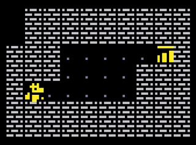

# Rougelike
_A Pico-8 Rougelike built following the excellent [Lazy Devs Academy's Porklike Playlist](https://www.youtube.com/playlist?list=PLea8cjCua_P3LL7J1Q9b6PJua0A-96uUS)_

 

## But why?
I love creating simple things, Lua is a new language, there's procedural generation, and most of all, Pico-8 looks rad! 